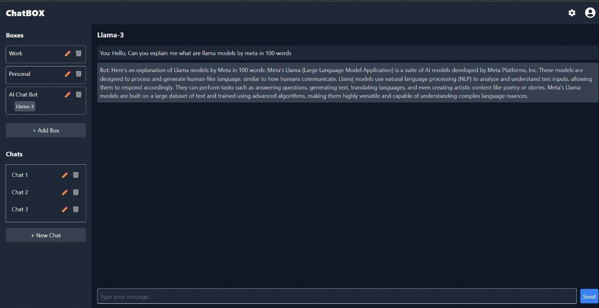

# ChatBOX

ChatBOX is an AI-powered chatbot platform, similar to ChatGPT or Claude, but with an added **Boxes** feature for organizing conversations. The project uses Ollama to run the LLaMA-3.1:8B model locally and integrates it as an API with a React-Vite front-end.

## Demo Video

[](https://drive.google.com/uc?export=view&id=1BDCIemul9zPUdhF5d3lPfSkQCROPQ7Gy)


## Features
- AI chatbot interface powered by LLaMA-3.1:8B.
- Boxes (folders) to organize chats for better usability.
- Local deployment of the LLaMA model for maximum control and efficiency.

---

## Installation and Setup

Follow these steps to set up the project locally:

### 1. Prerequisites
Ensure you have the following installed on your system:
- **Node.js** (v16 or higher)
- **npm** or **yarn**
- **Vite** (comes with the project setup)
- **Docker** (required for Ollama)

---

### 2. Install Ollama
Ollama is required to run the LLaMA-3.1:8B model locally.

1. Download and install Ollama from [ollama.ai](https://ollama.ai/download).
2. Follow the installation instructions for your operating system.
3. Verify the installation by running:
   ```bash
   ollama --version
   ```

---

### 3. Download the LLaMA-3.1:8B Model
1. Open a terminal and pull the LLaMA-3.1:8B model:
   ```bash
   ollama pull llama-3.1:8b
   ```
2. Wait for the download and setup to complete.

---

### 4. Run the LLaMA Model Locally
1. Start the LLaMA model using Ollama:
   ```bash
   ollama run llama-3.1:8b
   ```
---

### 5. Set Up the React-Vite Front-End
1. Clone the ChatBOX repository:
   ```bash
   git clone https://github.com/yourusername/chatbox.git
   cd chatbox
   ```
2. Install the dependencies:
   ```bash
   npm install
   ```
3. Start the development server:
   ```bash
   npm run dev
   ```
---

## Folder Structure
- **/boxes**: Organizes chat conversations into folders for easy access.
- **/api**: Contains API configuration and utilities to communicate with the LLaMA model.
- **/components**: React components for the chatbot interface and UI elements.

---

### Contributions
Feel free to contribute to the project by submitting pull requests or reporting issues.

---
